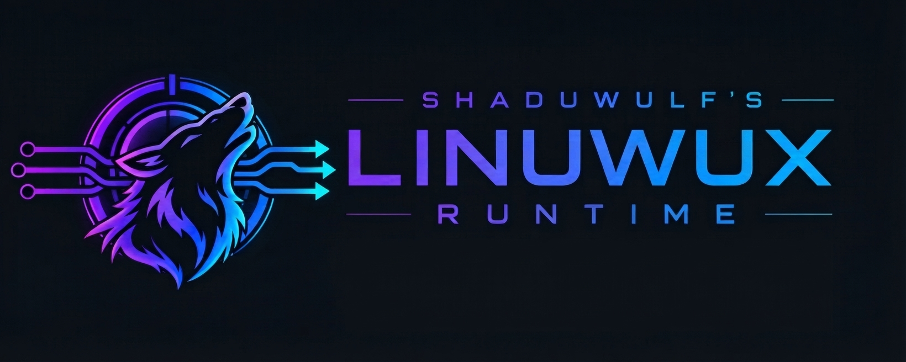

<p align="center">
  
</p>

<p align="center">
  Standalone Linux runtime for Wine &amp; Proton.
</p>

<p align="center">
  <a href="#is-it-production-ready">
    
  </a>
  <a href="#which-architectures-are-supported">
    
  </a>
  <a href="https://github.com/xshaduwulfx/shaduwulf-linuwux-runtime/actions/workflows/ci.yml">
    
  </a>
  <a href="LICENSE">
    
  </a>
  <a href="https://github.com/xshaduwulfx/shaduwulf-linuwux-runtime/stargazers">
    
  </a>
</p>

<p align="center">
  <a href="#how-do-i-use-the-runtime">Usage</a>
  ·
  <a href="#architecture">Architecture</a>
  ·
  <a href="#build">Build</a>
  ·
  <a href="#tests">Tests</a>
  ·
  <a href="#faq">FAQ</a>
</p>

---

## About

**Shaduwulf's LinUwUx Runtime** is a standalone runtime rework of the functionality provided by
`LinUwUx.patch`.

Instead of applying the LinUwUx modifications directly to Wine and Proton,
this project provides the required behavior through a preloadable Linux
shared library.

The goal is to decouple the LinUwUx runtime behavior from a particular
Wine or Proton source tree and make it possible to use and develop the
implementation independently.

> [!IMPORTANT]
> This project is experimental and under active development.

## FAQ

### What is Shaduwulf's LinUwUx Runtime?

Shaduwulf's LinUwUx Runtime is a standalone runtime rework of the
functionality provided by the original `LinUwUx.patch`.

Instead of keeping the LinUwUx modifications embedded in Wine and Proton,
the runtime implements the relevant behavior in a preloadable Linux shared
library.

### How do I use the runtime?

First build the runtime as described in [Build](#build), then install it:

```sh
sh scripts/install-runtime.sh
```

This installs the runtime as:

```text
~/.local/lib/liblinuwux_runtime.so
```

and the launcher as:

```text
~/.local/bin/linuwux
```

The `linuwux` launcher injects the runtime through `LD_PRELOAD` while
preserving an existing preload chain.

#### Steam

Select Proton-CachyOS or Proton-GE as the game's compatibility tool.

Open **Properties → General → Launch Options** and add:

```text
~/.local/bin/linuwux %command%
```

#### Faugus Launcher

Select Proton-CachyOS or Proton-GE as the game's runner.

1. Right-click the game.
2. Select **Edit**.
3. Find **Game Arguments**.
4. Add:

```text
LD_PRELOAD=/home/YOUR_USERNAME/.local/lib/liblinuwux_runtime.so
```

Replace `YOUR_USERNAME` with your Linux username.

If the game already has arguments, keep them and add the `LD_PRELOAD`
assignment alongside them.

For runtime logging:

```text
LINUWUX_DEBUG=1 LD_PRELOAD=/home/YOUR_USERNAME/.local/lib/liblinuwux_runtime.so
```

#### Heroic Games Launcher

Select Proton-GE or another compatible community Proton build.

1. Open the game's **Settings**.
2. Select **Advanced**.
3. Find **Environment Variables**.
4. Add:

```text
Name:  LD_PRELOAD
Value: /home/YOUR_USERNAME/.local/lib/liblinuwux_runtime.so
```

Replace `YOUR_USERNAME` with your Linux username.

For runtime logging, add another environment variable:

```text
Name:  LINUWUX_DEBUG
Value: 1
```

Do not put `LD_PRELOAD=...` in **Game Arguments**. Heroic provides a
dedicated environment-variable configuration.

#### Lutris

Open the game's configuration and go to:

**System options → Environment variables**

Add:

```text
Key:   LD_PRELOAD
Value: /home/YOUR_USERNAME/.local/lib/liblinuwux_runtime.so
```

Replace `YOUR_USERNAME` with your Linux username.

For runtime logging:

```text
Key:   LINUWUX_DEBUG
Value: 1
```

#### Command line

Any Linux-side command can be wrapped directly:

```sh
~/.local/bin/linuwux COMMAND [ARG...]
```

The runtime can also be injected manually:

```sh
LD_PRELOAD="$HOME/.local/lib/liblinuwux_runtime.so${LD_PRELOAD:+:$LD_PRELOAD}" \
COMMAND [ARG...]
```

Using the `linuwux` launcher is preferable when possible because it
preserves the existing preload chain automatically.

#### Debugging

Enable runtime logging with:

```sh
LINUWUX_DEBUG=1 ~/.local/bin/linuwux COMMAND [ARG...]
```

A different runtime library can be selected explicitly with:

```sh
LINUWUX_PRELOAD=/path/to/liblinuwux_runtime.so \
~/.local/bin/linuwux COMMAND [ARG...]
```

The `linuwux` launcher does not select or configure Proton. It wraps the
existing Linux-side launch command and injects the runtime into its process
environment.

### Which Proton versions are supported?

The runtime primarily targets community Proton builds.

The main supported and tested environments are:

- Proton-CachyOS
- Proton-GE

These are the Proton variants currently intended for use with
Shaduwulf's LinUwUx Runtime.

Valve's official Proton builds are currently outside the supported target
and should not be assumed to work with the runtime.

Compatibility with other Wine or Proton builds may vary.

### Does it require a custom Proton build?

No.

One of the main purposes of the runtime architecture is to provide the
LinUwUx behavior without requiring the LinUwUx modifications to be compiled
directly into Wine or Proton.

A compatible Wine/Proton environment is still required to run Windows
software. Proton-CachyOS and Proton-GE are the primary targets.

### Does it patch or replace Wine or Proton?

No.

The runtime is loaded into the Linux-side process environment through
`LD_PRELOAD`.

It does not replace Wine or Proton binaries and does not require a patched
Wine or Proton source tree.

### Is this the same as LinUwUx.patch?

No, although it implements the same LinUwUx protocol and is a rework of the
behavior introduced by `LinUwUx.patch`.

The original `LinUwUx.patch` implements LinUwUx through modifications to
Wine and Proton.

Shaduwulf's LinUwUx Runtime restructures that behavior into a standalone
shared library and extends the implementation where required by the runtime
architecture.

### Why use a standalone runtime?

Keeping the LinUwUx behavior outside Wine and Proton reduces its coupling
to a particular Wine or Proton source tree.

Instead of maintaining the functionality as modifications spread across
Wine and Proton, the runtime organizes the implementation into focused
components with separate responsibilities.

These include:

- CPUID interception and protocol handling
- syscall redirection
- Syscall User Dispatch integration
- KUSER_SHARED_DATA handling
- faketime handling
- Wine prefix registry handling
- signal handling
- `prctl` interposition
- time-function interposition

This makes individual mechanisms easier to develop, test and maintain
without carrying the complete LinUwUx implementation as a monolithic
Wine/Proton patch.

### How is the runtime structured?

The runtime is intentionally modular.

Its main mechanisms are split into focused components for CPUID handling,
syscall redirection, Syscall User Dispatch, KUSER_SHARED_DATA, faketime,
Wine-prefix integration, signal handling and `prctl` interposition.

These components are linked into a single preloadable shared library:

```text
liblinuwux_runtime.so
```

See the [Architecture](#architecture) section for the complete module layout
and runtime flow.

### Is this part of Shaduwulf's Proton LinUwUx?

Yes.

Shaduwulf's LinUwUx Runtime belongs to the Shaduwulf's Proton LinUwUx
project family.

Unlike the original patch-based approach, however, the runtime is designed
to exist independently of a particular custom Proton source tree.

### How is the runtime loaded?

The runtime is a native Linux shared library loaded through `LD_PRELOAD`.

The included `linuwux` launcher configures the preload environment and then
executes the requested command.

Existing `LD_PRELOAD` entries are preserved, with the LinUwUx runtime
appended to the preload chain rather than replacing them.

### Which architectures are supported?

Currently, x86-64 Linux is supported.

Some runtime mechanisms are architecture-specific, including the `prctl`
interposer entry point, CPUID handling and CPU-context manipulation.

### Is it production-ready?

Not yet.

The project is experimental and under active development.

The core LinUwUx mechanisms are implemented and have focused tests, but
broader testing across games, Proton versions and runtime environments is
still required.

### Why LGPL-2.1-or-later?

Shaduwulf's LinUwUx Runtime is distributed under the GNU Lesser General
Public License version 2.1 or later.

This keeps the project licensing aligned with the Wine-side origins of the
LinUwUx functionality while allowing the runtime to remain a separately
loadable library.

See `LICENSE` and `NOTICE.md` for licensing and provenance information.

## Current implementation

The runtime currently implements the core mechanisms required by the
LinUwUx protocol, including:

- CPUID interception and LinUwUx command handling
- CPU vendor spoofing
- `TargetSysHandler` registration
- syscall redirection
- Syscall User Dispatch integration
- LinUwUx syscall trampoline ABI handling
- XMM4 syscall-number forwarding
- XMM5 one-shot syscall bypass handling
- KUSER_SHARED_DATA setup and patching
- faketime handling and shared faketime state
- Wine prefix `HwProfileGuid` handling
- Proton-related environment setup
- signal-handler interposition
- `prctl` interposition
- `clock_gettime` and `gettimeofday` interposition

The current implementation targets x86-64 Linux.

## Architecture

The runtime is built as:

```text
liblinuwux_runtime.so
```

It is loaded into the target process through `LD_PRELOAD`.

The implementation is intentionally split into focused runtime modules.
Each module is responsible for a distinct part of the LinUwUx behavior:

```text
src/
├── runtime.c       runtime initialization and common infrastructure
├── signals.c       signal interposition and dispatch
├── cpuid.c         CPUID faulting, spoofing, and LinUwUx command handling
├── syscall.c       syscall redirection and trampoline ABI handling
├── sud.c           Syscall User Dispatch state and selector handling
├── prctl.c         prctl interposition and SUD integration
├── prctl_entry.S   x86-64 prctl interposition entry point
├── kuser.c         KUSER_SHARED_DATA setup and patching
├── time.c          faketime state and time-function interposition
└── registry.c      Wine-prefix hardware-profile registry handling
```

This separation keeps the LinUwUx-specific mechanisms isolated from one
another instead of concentrating the runtime behavior in a single
interposition layer.

`runtime.c` provides the common initialization path, while the individual
modules implement the corresponding protocol or compatibility mechanisms.

The shared library is built with hidden ELF visibility by default. Only
the interfaces that must interpose host functions are exported.

The currently exported interposers are:

```text
clock_gettime
gettimeofday
prctl
sigaction
```

Internal `linuwux_*` interfaces remain private to the runtime and are linked
between the individual modules without becoming part of the public dynamic
symbol table.

### Runtime flow

At a high level, the runtime operates as follows:

```text
LD_PRELOAD
    │
    ▼
runtime initialization
    │
    ├── signal handling
    ├── faketime state
    ├── KUSER_SHARED_DATA
    ├── CPUID faulting / command protocol
    ├── Syscall User Dispatch
    └── Wine-prefix integration
    │
    ▼
LinUwUx runtime behavior
```

The architecture is designed so that these mechanisms can evolve
independently while continuing to expose a single preloadable runtime
library to the launcher.

## Build

Build the runtime with:

```sh
make
```

Clean the build with:

```sh
make clean
```

The resulting shared library is created in the repository root:

```text
liblinuwux_runtime.so
```

## Tests

Focused runtime tests are currently provided for:

- faketime CPUID behavior
- repeated faketime state updates
- syscall trampoline resume semantics
- XMM4 syscall-number forwarding
- XMM5 one-shot bypass semantics

Some test binaries must be executed from a filesystem that permits
execution.

## Relationship to LinUwUx.patch

The original `LinUwUx.patch` implements LinUwUx by modifying Wine and
Proton.

Shaduwulf's LinUwUx Runtime takes a different architectural approach:
the relevant behavior is implemented in a standalone shared library rather
than requiring those modifications to remain embedded in a custom
Wine/Proton source tree.

## Credits

The original LinUwUx work and `LinUwUx.patch` were created by **LinUwUx**.

Special thanks to **LinUwUx** for the original work and for giving this
standalone rework the green light.

For provenance and licensing details, see `NOTICE.md`.

## License

Shaduwulf's LinUwUx Runtime is distributed under the
GNU Lesser General Public License version 2.1 or later.

See `LICENSE` for the complete license text.
